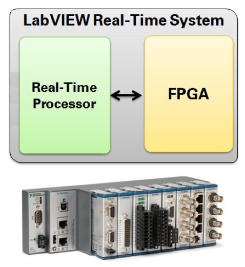
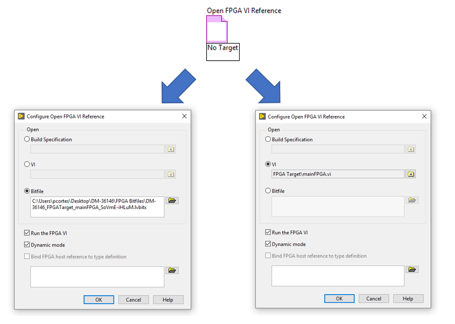
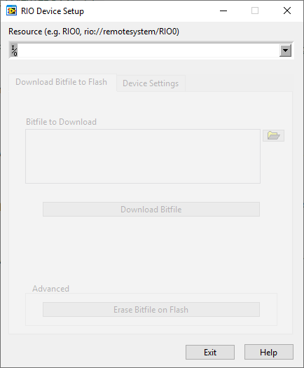

# Bitfile Deployment in CompactRIO

This document explains different ways to deploy a bitfile to the CompactRIO.
Is needed to understand what is a CompactRIO, how to program it, what is a bitfile, and how many options we have to deploy this bitfile into the CompactRIO.

## What is the CompactRIO?

The CompactRIO is a high-performance embedded controller that features industrial I/O modules, extreme ruggedness, industry-standard certifications, and integrated vision, motion, industrial communication, and human machine interface (HMI) capabilities.
CompactRIO systems feature a controller with a Real-Time Processor (RT) running a Linux Real-Time operative system and a chassis that contains field programmable gate arrays (FPGA), in the following image:



### Field Programmable Gate Arrays (FPGA)

FPGAs are silicon chips with unconnected logic gates. 
You can define the functionality of the FPGA by using software to configure the FPGA gates. 
FPGAs are completely reconfigurable and instantly take on a brand new “personality” when you download a different configuration of circuitry.

Common use of FPGA are high-performance control loops, high-speed signal acquisition and generation, signal processing and analysis, safe state logic, etc.

### Programming the FPGA With LabVIEW

The FPGA circuitry is configured using the NI LabVIEW FPGA Module.
The first step is develop a FPGA VI in LabVIEW to define the FPGA logic.
You can download and run only one top-level FPGA VI at a time on a single FPGA target. 
If you download a second top-level VI to the FPGA target, the second VI overwrites the first VI.

After the FPGA VI is developed, you want to execute the VI on
the FPGA target, which will require compiling of code.

### Compiling the FPGA VI

The LabVIEW FPGA Module compiles VIs to FPGA hardware using an automatic, multi-step process. 
Behind the scenes, the VI is translated to text-based **V**ery-High-Speed Integrated Circuit **H**ardware **D**escription **L**anguage (VHDL) code.
Then industry-standard Xilinx ISE compiler tools optimize, reduce, and synthesize the VHDL code into a hardware circuit realization of the LabVIEW design. 
During the FPGA compilation, the VI is optimized to reduce digital logic and create an optimal implementation of the LabVIEW application. 
The end result is a `bitfile` (.lvbitx) that contains binary data that describes how to configure the FPGA circuit of the FPGA target. 
When the application runs, the bitfile reconfigures the FPGA circuit of the FPGA target. 
Go [here](https://www.ni.com/docs/en-US/bundle/labview-fpga-module/page/lvfpgaconcepts/compiling_fpga_vis.html) to know more details about the compilation process.

Each bitfile is unique to the type of the FPGA target for wich the bitfile was compiled.

After we have this bitfile just created, is time to download it into the CompactRIO and create this new "personality".

## How to deploy the bitfile into the CompactRIO?

Following are the available options to download the bitfile into the CompactRIO.

### 1. Using NI LabVIEW Real-Time Module

The LabVIEW Real-Time Module is a LabVIEW add-on you can use to create reliable, stand-alone applications that execute on embedded hardware devices like a CompactRIO.

The most prevalent method for deploying an FPGA personality (bitfile) is to embed it into the host application. 
This inclusion into the application occurs when the `Open FPGA Reference` LabVIEW function is used in the host implementation. 
When the host application is then compiled into an executable (`.rtexe`) the FPGA application is embedded inside this file. 
Therefore when the host application is deployed and run, it will download the bitfile and open a reference to the FPGA when the Open FPGA Reference function is called.

Once you have the Open FPGA Reference function placed on the VI, right click and select `Configure Open FPGA VI Reference ...` . The dialog box will appear and you can specify open either the FPGA VI or the bitfile, in the following image:



Go [here](https://www.ni.com/docs/en-US/bundle/labview-fpga-module/page/lvfpgahost/open_fpga_vi_reference.html#:~:text=Right%2Dclick%20the%20Open%20FPGA,VI%20and%20the%20FPGA%20VI.) to know more details about this function.

This option forces you to have the LabVIEW Real-Time Module installed in a Windows machine and deploy the executable into the Real-Time processor.

### 2. Using NI LabVIEW FPGA Module

NI LabVIEW FPGA is a software add-on for LabVIEW that you can use to more efficiently and effectively design FPGA-based systems through a highly integrated development environment.
This allows you to create a FPGA VI that will be converted into a bitfile.

This module also allows you to test the program logic to validate its operation, using the interactive front panel communication, in which the run button is asserted for an FPGA VI in the development environment.
This will begine the compilation process if the bitfile is not created yet or it was modified after the last time it was compiled, and will deploy the FPGA personality to the FPGA target.

It is important to note that interactive front panel communication should only be used for the development phase of an FPGA application as the configuration on the FPGA is volatile. 
When the bit file is downloaded to the FPGA it will be lost if the device is power cycled, therefore another method is required for stand-alone deployments.

Go to [here](https://www.ni.com/docs/en-US/bundle/labview-fpga-module/page/lvfpgaconcepts/ifp_comm.html) for more information about this.

### 3. Using the RIO Device Setup

The [NI CompactRIO](https://www.ni.com/en-us/support/downloads/drivers/download.ni-compactrio.html#460669) is a driver software that provides support for identifying, programming, and deploying CompactRIO systems. 
When you install this driver, the `RIO Device Setup` tool is installed. 
This tool is used for downloading a bitfile in the non-volatile flash memory on the FPGA target. 
The are two ways to find this tool in your Windows machine:

a) Go to Start >> National Instruments >> RIO Device Setup.

b) Go to LabVIEW Project Explorer window, right-click the FPGA target, and select RIO Device Setup from the shortcut menu. 

In both options the RIO Device Setup dialog box is like the following image:



In the configuration window, use the `Download Bitfile to Flash` tab to download a bitfile to FPGA flash memory.
Use the `Bitfile to Download` box to find the desired bitfile.

In the configuration window, use the `Device Settings` tab to configure when the FPGA loads the bitfile from flash memory using one of the following options:

- **Do not autoload**: Does not load the bitfile from flash memory at startup.
- **Autoload VI on device powerup**: Loads the bitfile that is stored in flash memory to the FPGA when the system powers up.
- **Autoload on device reboot**: Loads the bitfile that is stored in flash memory to the FPGA when you reboot the system either with or without cycling power.

If you choose the `Autoload on device reboot` option, then as soon as your device reboots, the device immediately loads the bitfile stored in flash memory and runs the FPGA VI if the `Run when loaded to FPGA` checkbox was enabled in the build specification used to create the bitfile.
Therefore, you can control the FPGA I/O state of your device as soon as the device is powered on or rebooted.

### 4. Using Linux Command Line

Developers can develop, debug, and deploy applications to the Real-Time Processor written entirely in C or C++ using a preferred integrated development environment (IDE).

After the FPGA bitfile is created, you can use the [FPGA Interface C API](https://www.ni.com/en-us/support/documentation/supplemental/09/introduction-to-the-fpga-interface-c-api.html) to generate header files and use them as an interface between the C/C++ application and the FPGA target.

### 4.1 Generate the C API

- Select the FPGA VI created (under FPGA Target).
- Right-Click -> "Launch C API Generator...".
- Select the output directory.
Leave Prefix Override blank. 
If you do not specify a custom prefix, the FPGA Interface C API Generator names files and constants based on the name of the FPGA VI from which the application bitfile was compiled.
- Click `Generate`.
- Copy the generated files to a selected directory in your C/C++ project.

The generated FPGA Interface C API consists of the following files: a `.h` file, a `.lvbitx` file, `NiFpga.h`, and `NiFpga.c`:

- **Generated .h File**: The .h file is a C header file that contains all the constants required by function calls in your application. 
- **Generated .lvbitx Bitfile**: This is a version of the original .lvbitx bitfile, renamed to match the prefix of the constants in the .h header file. NiFpga_Open() must find this file in order to ensure the bitstream is downloaded to the FPGA.
- **NiFpga.h**: This is a C header file. It is identical for all generated C APIs. It declares all the errors, types, constants, and functions needed to write an application. Most of these functions are defined in NiFpga.c.
- **NiFpga.c**: This is a C source file that you must include in your application. It is identical for all generated C APIs. It defines all the functions your application can call. NiFpga.c loads and unloads the NiFpga library at runtime, and forwards function calls to that library.

Follow [this link](https://www.ni.com/docs/en-US/bundle/fpga-interface-c-api-ref/page/capi/fpgac.html) to read the C API Help documentation.

### 4.2 Deploy Bitfile into CompactRIO

Because of the generated `.lvbitx` is a version of the original bitfile created from the FPGA VI, and this is used by the generated C API interface, this new bitfile is needed to download into the CompactRIO, instead of the original one.

After creating the C/C++ project, including source code and header files, send the compiled file and the new bitfile into the CompactRIO.
For this, follow the recomended steps:

- ssh to the CompactRIO.
- Create a new directory to store the .lvbitx and the C/C++ compiled file.
```
$ mkdir <reasonable_directory>
```
- Copy build file from Linux computer to CompactRIO.
```
$ scp <build_file> <user>@<cRIO_ip>:<reasonable_directory>/.
```
- Copy the .lvbitx from the Linux computer to cRIO.
```
$ scp <NiFpga_<name_of_FPGA_vi>.lvbitx> <user>@<cRIO_ip>:<reasonable_directory>/.
```
By default <user> is admin and password in "blank" in CompactRIOs.

- Go to the <reasonable_directory> on CompactRIO.
- Give permission to run the executable.
```
$ chmod +x <build_file>
```
- Run the executable.
```
$ ./<build_file>
```
